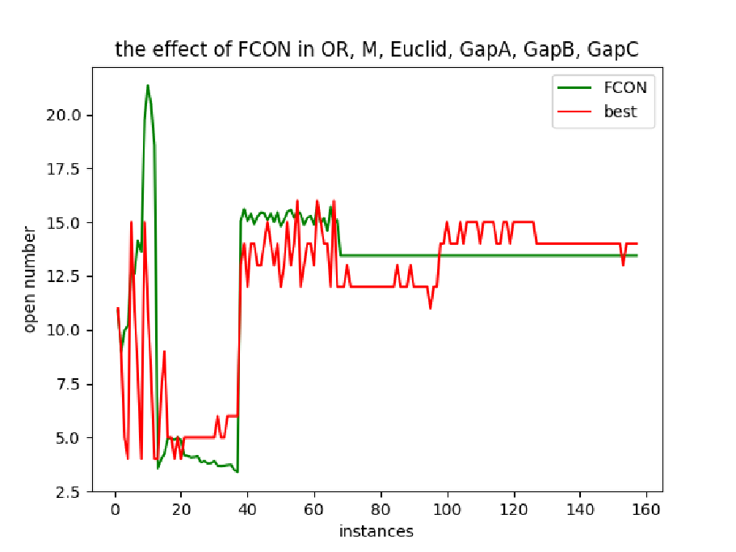
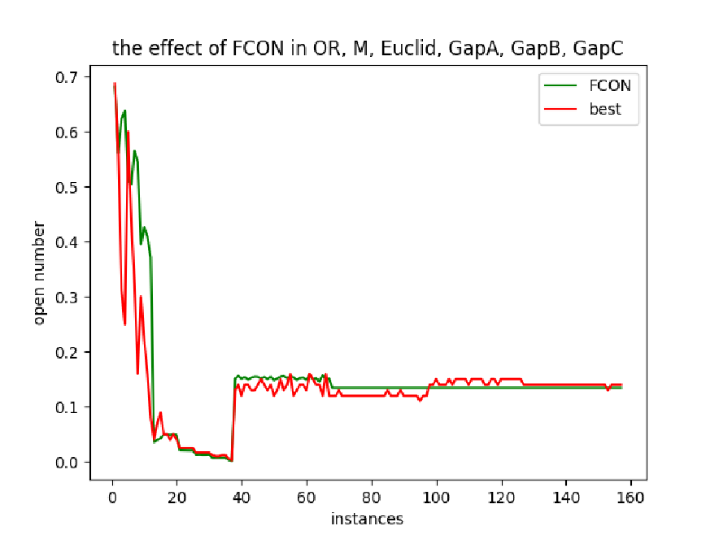

# uncapacitated facility location problems (UFLP): algorithm implementation, datasets, proposed heuristic experience
This repository is for SUSTech CS321 Group Project Ⅰ. We are solving *uncapacitated facility location problems* (UFLP) with experience-assisted optimization. 

## Project Details

The main contribution in this project consists of three parts:

1. **[Two state-of-the-art algorithms are implemented in Python](https://github.com/0SliverBullet/Experience-assisted-Combinatorial-Optimization/tree/main/algorithm_implementation)**: 

- an *enhanced group theory-based optimization algorithm* (EGTOA), from the paper titled "[A fast and efficient discrete evolutionary algorithm for the uncapacitated facility location problem](https://www.sciencedirect.com/science/article/pii/S0957417422019960)".
- an *evolutionary simulated annealing* (ESA) , from the paper titled "[Solving large-scale uncapacitated facility location problems with evolutionary simulated annealing](https://www.tandfonline.com/doi/abs/10.1080/00207540600621003)".

Codes are publicly available on [algorithm implementation](https://github.com/0SliverBullet/Experience-assisted-Combinatorial-Optimization/tree/main/algorithm_implementation).

2. We collect **[6 benchmarks for UFLP](https://github.com/0SliverBullet/Experience-assisted-Combinatorial-Optimization/tree/main/benchmark)** from https://resources.mpi-inf.mpg.de/departments/d1/projects/benchmarks/UflLib/index.html, where $OR$ and $M*$ are the most popular benchmarks used in most paper currently. Meanwhile, we also upload 4 other benchmarks named $Euclid$, $GapA$, $GapB$, and $GapC$.

   The information on the 6 benchmarks for UFLP is summarized as follows:

   | benchmark  | Instance            | facility | customer |
   | ---------- | ------------------- | -------- | -------- |
   | OR-Library | Cap71∼ Cap74        | 16       | 50       |
   |            | Cap101∼ Cap104      | 25       | 50       |
   |            | Cap131∼ Cap134      | 50       | 50       |
   |            | CapA∼ CapC          | 100      | 1000     |
   | M*         | MO1∼ MO5            | 100      | 100      |
   |            | MP1∼ MP5            | 200      | 200      |
   |            | MQ1∼ MQ5            | 300      | 300      |
   |            | MR1∼ MR5            | 500      | 500      |
   |            | MS1                 | 1000     | 1000     |
   |            | MT1                 | 2000     | 2000     |
   | Euclid     | 111EuclS∼ 3011EuclS | 100      | 100      |
   | GapA       | 332GapAS∼ 3232GapAS | 100      | 100      |
   | GapB       | 331GapBS∼ 3231GapBS | 100      | 100      |
   | GapC       | 333GapCS∼ 3233GapCS | 100      | 100      |
   
3. We **[propose a new model](https://github.com/0SliverBullet/Experience-assisted-Combinatorial-Optimization/tree/main/fc_open_number)** *f-c open number* (FCON), a heuristic experience to assist in enhancing existing evolutionary algorithms for better solving UFLP, to predict how many facilities we should open in the optimal solution by using machine learning which trains from small-scale instances and predicts on the large-scale instances. 

FCON can reduce the solution space but not significantly. For the instance with 100 facilities, although FCON claims that the optimal solution exists in the solution with the open number $n_{opt} \in [n_{pred}-4, n_{pred}+4]$, the solution space just reduces from $2^{100} (1.3 \times 10^{30})$ to $\sum_{i=n_{pred}-4}^{n_{pred}+4} C(100, i) \in [2.1 \times 10^{12}, 8.0 \times 10^{29}]$, which is not significant effect.

However, I still believe the model is useful to some extent and I will explore more useful heuristic experiences in the future.

(Updated in March 2024)
